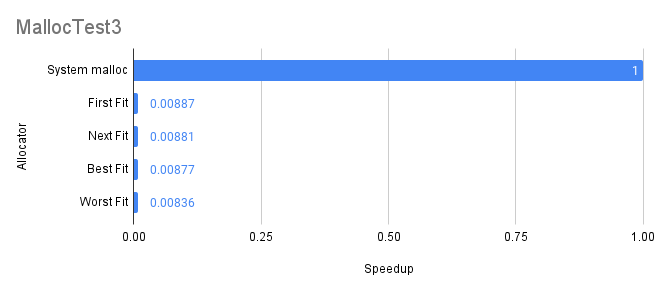

# Custom Malloc Implementation

Betim Hodza

1001928702

## Executive Summary

In total, four algorithms were implemented: First Fit, Next Fit, Best Fit, and Worst Fit. These algorithms find a free block within the heap and give it to malloc to allocate a certain size onto the heap-linked list.

#### First Fit

This algorithm is relatively simple. Given a size and heap list, it'll loop through the heap list, and when it finds the first place that the given size would fit in, it'll take that spot. This implementation starts at the beginning of the heap list every time, so when it reaches the end of the list and hasn't found big enough space, it must grow the heap to fit that allocation.

#### Next Fit

This algorithm is a modification of First Fit, it'll search through the heap list, and when it finds the first spot that is available to allocate it will take it. Once it does take it, It'll save its spot where it was allocated, so that when it needs to allocate again, it'll pick up where it has left off. If the algorithm loops to back where it started, it must grow the heap. This is generally better than First Fit since it won't need to search the same spot twice usually, but it's not much better than First Fit.

#### Best Fit

Best Fit is a more advanced algorithm than the other two. The idea for this algorithm is to find the best spot to allocate a block in the heap. It will search the whole heap list with the size it's looking for and save the size closest to the size it wants to allocate but leave the least amount of space behind, hence the name Best Fit. If it has searched the whole list and can't find anywhere where the allocation can happen, it will grow the heap. This algorithm is generally much more efficient than the First and Next fit.

#### Worst Fit

Worst Fit is almost exactly like Best Fit, except instead of finding the best spot, it will pick the worst spot. It will search the whole heap list with the size requested and save the size that results in the most amount of space left over after allocation. If it has searched the whole list and can't find anywhere to allocate, it has to grow the heap. This is generally the preferred algorithm in most OSs.

### Test Implementations

There were a total of 5 tests written to compare the performance of the 4 different custom malloc algorithms, and the Operating Systems Malloc.

#### Test 1 Sequential Allocation and Frees

The goal of this test is to evaluate the allocator's performance with predictable allocation and deallocation patterns. It will loop N (1000) amount of times and allocate block sizes of 128 bytes, then loop over each of the allocated blocks and free them.

#### Test 2 Random Allocations and Frees

The main objective of this test is to simulate unpredictable allocation patterns of what a real program could do. It will initialize an array of pointers size of N, then loop N times. Each iteration of that loop it'll randomly decide to allocate a random size between 16 to 1024 bytes or free a randomly allocated pointer. At the end of this loop, free any remaining memory.

#### Test 3 Mixed Size Allocations

This Test will test the allocator's ability to handle various block sizes. Similar to past tests it loops N times, and allocates a block size I mod M, where M is a modulus value to vary sizes. At the end, it will free the blocks in reverse order.

#### Test 4 Reapeated Allocations and Frees

Test 4 evaluates the allocator performance over time with repeated operations of allocating and deallocating. For a T(100) amount of times we allocate and deallocate N(1000) amount of times.

#### Test 5 Stress Test with High Memory Demands

Test 5 Determine the allocator's behavior under high memory pressure, It will continuously allocate large blocks until allocation fails (returns NULL). After allocation fails it will free all allocated blocks.

### Table Test Results

The results were computed using 2 different shell scripts. BetimVsMalloc.sh and comparePerformance.sh. You can run BetimVsMalloc.sh first and it will cleanly make the execution files for the custom malloc program and run the system malloc against the tests, and the 4 algorithms of custom malloc against the tests as well. Afterward, you can run comparePerformance.sh which will take the results of the performance of the program from each file and compute the difference in speeds between the two.

First here's the result that comparePerformance.sh shows:

```
Performance Comparison of Custom malloc Implementations vs System malloc
=========================================================================================
Test Program    Allocator       Time (s)        Speedup         MaxHeap         Fragments       Splits   
mallocTest1     System          0.000929        1.00000x        N/A             N/A             N/A  
mallocTest1     First Fit       0.148456        0.00626x        1600000         0.000000        1   
mallocTest1     Next Fit        0.123686        0.00751x        1600000         0.000000        1   
mallocTest1     Best Fit        0.118884        0.00781x        1600000         0.000000        1   
mallocTest1     Worst Fit       0.197220        0.00471x        1600000         0.000000        1   
---------------------------------------------------------------------------------------------------
mallocTest2     System          0.000061        1.00000x        N/A             N/A             N/A  
mallocTest2     First Fit       0.000057        1.07017x        16892           0.031811        9   
mallocTest2     Next Fit        0.000056        1.08928x        16892           0.031811        9   
mallocTest2     Best Fit        0.000103        0.59223x        19828           0.683276        14  
mallocTest2     Worst Fit       0.000054        1.12963x        16892           0.035664        9   
---------------------------------------------------------------------------------------------------
mallocTest3     System          0.002722        1.00000x        N/A             N/A             N/A  
mallocTest3     First Fit       0.336301        0.00809x        5340000         0.000000        1   
mallocTest3     Next Fit        0.337959        0.00805x        5340000         0.000000        1   
mallocTest3     Best Fit        0.337370        0.00807x        5340000         0.000000        1   
mallocTest3     Worst Fit       0.478140        0.00569x        5340000         0.000000        1   
---------------------------------------------------------------------------------------------------
mallocTest4     System          0.004989        1.00000x        N/A             N/A             N/A  
mallocTest4     First Fit       0.273497        0.01824x        28946944        0.000000        100   
mallocTest4     Next Fit        0.269688        0.01850x        28946944        0.000000        100   
mallocTest4     Best Fit        0.259395        0.01923x        28946944        0.000000        100   
mallocTest4     Worst Fit       0.299353        0.01667x        28946944        0.000000        100   
---------------------------------------------------------------------------------------------------
mallocTest5     System          0.013039        1.00000x        N/A             N/A             N/A  
mallocTest5     First Fit       0.006988        1.86591x        1073774592      0.000000        1   
mallocTest5     Next Fit        0.006984        1.86698x        1073774592      0.000000        1   
mallocTest5     Best Fit        0.006644        1.96252x        1073774592      0.000000        1   
mallocTest5     Worst Fit       0.006864        1.89962x        1073774592      0.000000        1   
---------------------------------------------------------------------------------------------------
```

#### Graphical Test Results

The graphs below show how many times faster or slower each algorithm of the custom-written malloc is compared to the Operating Systems Malloc for each test.

 

### Interpreting Results

Just looking at the graphs alone, we can tell that the Operating Systems malloc greatly outperformed my version of malloc, with the exceptions of test cases 2 and 5.

Test case 5, which tests based on high demands of memory, there are a few reasons why mine could've outperformed malloc in this metric, but I think it might have to do with my implementation is a doubly linked list instead of a single, making frees much faster.

Looking at Test Case 2 since this was more random and realistic, it had the most variaty of results showing the best fit having double the amount of allocations and splits for the max heap, and being also the slowest out of them all. It also showed Next Fit being more efficient as well as all of the custom algorithms beating malloc in this specific test. From these results, it looks like it's just as effective as normal malloc is.

Other than that looking at the tables comparing only the 4 algorithms against each other we tend to see Worst Fit performing the best of the 4 for most of the test cases. Worst Fit usually does better in most cases because it leaves the biggest blocks of memory behind, making it easy to just grab the next block of memory instead of growing the heap so much.

For the majority of test cases, they highly underperformed the systems malloc, I think the reason for this is because the use of doubly linked lists, and the way it manages the heap nodes is probably not the most efficient way. Trying to analyze some of the OS's malloc system performance from what I can get from Mallinfo it appears that malloc is highly optimized. This isn't the goal of this assignment, at least for me it's to know how Malloc works.

## Conclusion on AI performance

### Did the AI Assistant help?

I used chatgpt o1 preview model, and to be very honest, this LLM did 95% of the TODO part of the code. Although I did not just copy-paste everything it said to write, I instead typed everything out and tried to comment and understand along with the LLM asking it questions its performance is good. I was very surprised that it even did this much, and I wasn't expecting it to. I also listed my conversation with the model in ai-prompt.md so you can see exactly how I went through to get my answers from it.

#### Did it hurt?

I think the only thing that this tool did hurt, was me fully and organically struggling through the process of learning like I usually do. It kinda made me a lazy coder, and I don't like that, I feel like in the future the way I want to go is to limit it and try to talk and collaborate with others to get a better understanding of what I'm trying to accomplish and if my implementation is on the right track or not. That's one thing I like about this class is the struggle, it's truly made me a better programmer. And maybe I'll come back to this project and do it the old-fashioned way to get the neurons going.

#### Where did the AI tool excel?

It did really well at pretty much everything, I didn't struggle to get it to work with me, as with previous models I would mostly have to, I fed it generally the projects README and the code and it did most of the work for me. The only work I did was just testing and making sure the program properly performed how it should.

#### Where did the AI tool fail?

One area where the AI struggled was Formatting Output. The AI had difficulty ensuring the output formatting matched specific requirements. This is a common challenge among programmers, and the AI mirrored that struggle.

If I had to say one thing where it failed it's probably the formatting of the output, if 95% of people struggle with that in their code, it generally struggles with that too. But with this AI's context model, I feel like if you give it enough background it can effectively do what you convey it to do.

#### Do you feel you learned more, less, or the same if you had implemented it fully on your own?

I think if I did this on my own, I would've learned a whole lot more, and I still feel iffy and weird about the AI's code, I don't trust it, but it does indeed run and past the tests. I feel like I understand conceptually just as I did before, but to be honest, actually implementing it and thinking about trying to get C to do what you mean semantically is 10x harder than thinking of how a program works in a high-level view.